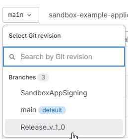
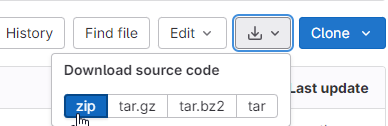
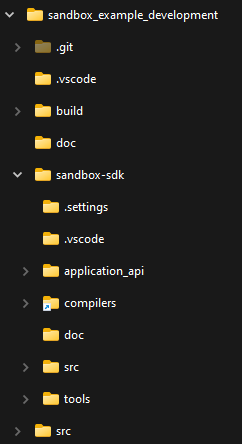

# Sandbox Example Application
This repository contains example applications and provides a starting point for your own application development.


## Acquiring the Example Application & SDK repository
There are different options for acquiring the example-application & SDK repositories.

The preferred and simpler method is [using git](#using-git). However, this requires some tools and might not be the best option for everyone. Alternatively there is the option to download [using the web-browser](#using-download-through-web-browser). 

When downloading, it is important to select the right branch depending on the desired SDK version, see [Branch selection depending on desired SDK version](#branch-selection-depending-on-desired-sdk-version).

### Branch selection depending on desired SDK version
In order to get the correct SDK version, select the correct branch. Below table lists some options
| SDK Version | Branch Name   | Description |
|-------------|---------------|-------------|
| 0.3         | Release_v_0_3 | For products supporting v0.3 |
| 1.0         | Release_v_1_0 | For products supporting v1.0 and above |
| upcoming    | main          | Contains features which have not been released yet. Should only be used in development environment |

***NOTE:*** when changing or updating the branch to a different version, make sure to also update submodules e.g. using ```git submodules update --recursive --init```.

### Using git
Clone the example-application repository to your computer. Make sure to select the right branch, depending on which SDK version you would like to use.

***NOTE:*** Git may ask you to sign in, before it starts cloning.
- Option A) using command line:
    ```cmd
    git clone --recurse-submodules -b Release_v_1_0 https://codebits.abb.com/drives-sw-common/sandbox-example-application.git
    ```
    - ***NOTE***: above command will directly select the branch ```Release_v_1_0```.
- Option B) using a GUI, e.g. TortoiseGit:
    1. Start git clone using the GUI, but make sure to select the ```Recursive``` option which will also initialize and clone the submodules
    2. Select/switch to the right branch, depending on which SDK version you would like to use, e.g. ```Release_v_1_0```
        - ***NOTE***: make sure to update the submodules after switching the branch

### Using Download through Web-Browser
1. Download the sandbox-example-application repository
    1. Open the sandbox-example-application repository in the web-browser.
    2. Select the right branch:
        
    3. Use the download button:
        
2. Download the sandbox-sdk repository
    1. Open the sandbox-sdk repository in the web-browser
    2. Select the correct sandbox-sdk branch. This should be the same as for the example-application repository.
    3. Download the content of the SDK repository.
3. Extract the sandbox-example-application repository
4. Extract the sandbox-sdk zip file as a sub-folder of the already extracted sandbox-example-application repository. The direction structure should then look as follows:
    


## How to get started / how to use the Sandbox SDK
See [sandbox-sdk/README.md](sandbox-sdk/README.md) locally or [here](https://codebits.abb.com/drives-sw-common/sandbox-sdk/-/blob/main/README.md) when reading this file directly from the repository. ***NOTE:*** make sure to select the right branch when following the link in the browser.


## How to create your own application repository
1. Simply fork the example app repository (this repository) and use the fork to develop your own applications.
    - The SDK repository, with all the necessary scripts and tools, will automatically be included as a submodule.
2. Modify the example application code under `src/c++` or `src/simulink`.
3. You can also create new applications:
    1. Create a new folder under `src` and place your source code in there 
        - You can copy example files from one of the existing applications to get started.
    2. Modify [SConstruct](SConstruct) so that the array `applications` contains & points to the new application


## Update to a new version of the SDK
Most of the time updates should only affect the sandbox-sdk submodule. In this case, updating to a new SDK version can simply be done by updating the sandbox-sdk submodule pointer to a newer commit/tag. For information on how to change submodule pointers, please refer to the official git documentation.

In rare cases, there might be changes to the Sandbox Example Application Repository build scripts. In this case, it might be necessary to (manually) update your fork of the example app repository with the changes.