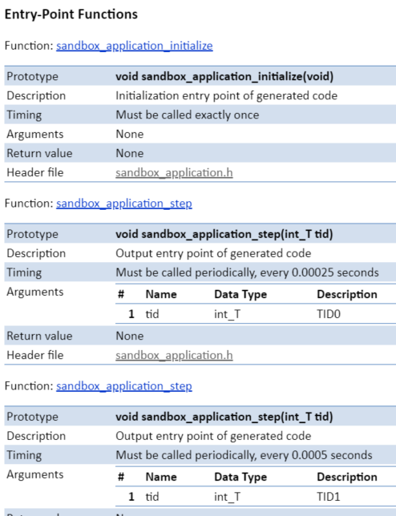
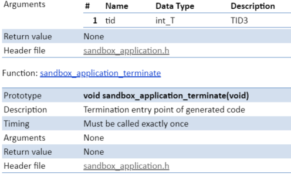
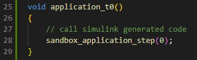
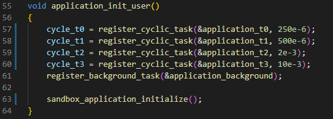
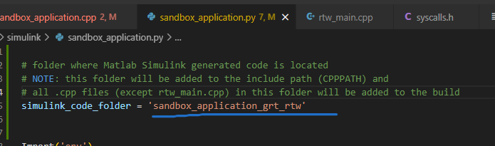
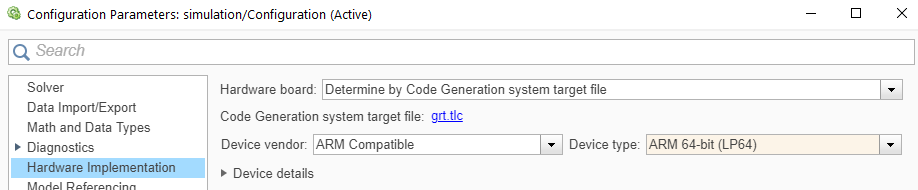
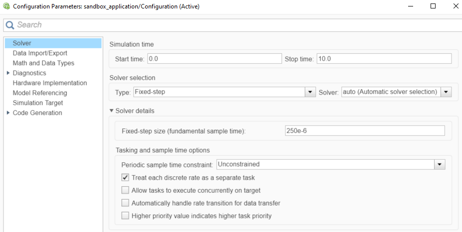
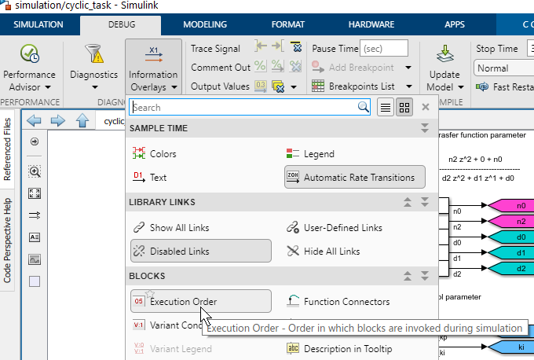

# Workflow for integrating a Matlab Simulink application into the Sandbox
## Quick start
In order to build a sandbox application from a Simulink model, the following steps 
should be executed:
- Open the simulink model (e.g. example sandbox_application.slx)
- Modify the model (optional)
- Generate code from the model in Simulink:
    - Launch the Simulink C Coder app (APPS --> Simulink Coder)
    - Generate Code (C++ CODE --> Generate Code)
    - Upon completion, the code generation report should open
- Compile the generated code to a sandbox application (see [here](../README.md#build-sandbox_application))
- Use application either with PC or UCON target

## Integrating the Simulink generated code into the sandbox
**_NOTE:_** these steps are especially important to verify when renaming the Simulink model, since Simulink will rename the generated files and functions. Otherwise compilation will fail.

In order to execute the Simulink generated code in the sandbox, the following steps need to be followed:
- After code generation, open the code generation report
- Go to the "Code interface report"
    - Find the name of the initialize and step functions
        - 
        - ...
        - 

- In [src/simulink/sandbox_application.cpp](../src/simulink/sandbox_application.cpp)
    - Make sure the function calls in application_tX call the correct Simulink generated functions (from previous step above)
        - 
        - **_NOTE:_** the index passed to the step function must match with the task index (TID0 .. TID3) used by Simulink
    - Make sure the function application_init_user calls the correct Simulink generated initialize function. Also make sure that the cycle times of application_tX matches with the expected cycle time of Simulink (see Code interface report).
        - 

- In [src/simulink/sandbox_application.py](../src/simulink/sandbox_application.py)
    - Make sure the correct folder generated by Simulink is referred
        - 


## Tools needed
In order to support simulation of embedded C/C++ code, Simulink requires a 64bit PC target compiler. Otherwise the following error message about a missing compiler will pop up.
MinGW64 can be added to Matlab as described [here](https://www.matlabsolutions.com/blog/i-already-have-mingw-on-my-computer-how.php). If you chose to install the x86_64 compiler when building using ```build.bat --architecture=x86_64```), you use ```[ABSOLUTE_PATH_TO_YOUR_SANDBOX_SDK_FOLDER]/compilers/winlibs-x86_64-posix-seh-gcc-11.3.0-mingw-w64msvcrt-10.0.0-r3/mingw64``` as MINGWROOT when calling ```configuremingw``` in Matlab.

## Simulink code generation project settings
- Hardware implementation settings
    - 

- Create step functions for multiple time levels / tasks: 
    - 

- Display execution order of simulink blocks:
    - 

